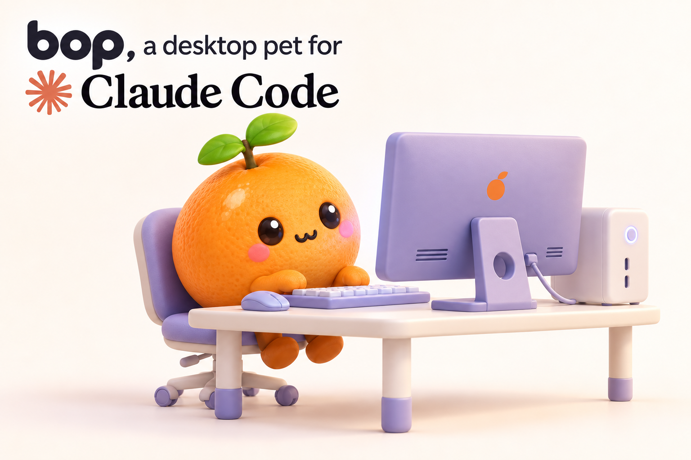

# Bop

**Bop — a desktop pet for Claude Code.**

Bop is a small pixel pet that lives on your desktop and shows what Claude Code is doing: it
thinks while Claude thinks, types while Claude edits code, waves when Claude needs your
permission, cheers when a task is done and looks sad when something fails. Click it to chat with
Claude in a little terminal-style speech bubble. You can make new pets with Claude, and pets use
the same format as Codex pets.

<p align="center">
  
</p>

The default pet is Pıtır, a small mandarin drawn entirely by Bop's own drawing engine.

> **Status:** early release (0.1.0). Windows is the most tested platform; macOS and Linux builds
> are produced by CI but have had little real-world use. Please report problems in
> [Issues](https://github.com/AlperenGonuk/bop/issues).

## Install

You need Claude Code. In a terminal:

```sh
claude plugin marketplace add AlperenGonuk/bop
claude plugin install bop@bop
```

Then, in a new Claude Code session (or after `/reload-plugins`):

```text
/bop setup
/bop
```

`/bop setup` downloads the Bop app for your platform (see [What gets downloaded](#what-gets-downloaded)).
`/bop` opens the pet; run it again to close it.

## Commands

| Command | What it does |
| --- | --- |
| `/bop` | Open the pet, or close it if it is open |
| `/bop setup` | Download and install the Bop app that matches the plugin version (skipped if already installed; `/bop setup --force` reinstalls) |
| `/bop list` | List installed pets (`*` marks the active one) |
| `/bop use <id>` | Switch to another pet; an open pet changes at once |
| `/bop install <folder>` | Install a pet from a local folder (`pet.json` + spritesheet) |
| `/bop stop` | Close the pet |

Right-click the pet for **New chat**, **Switch pet**, **Make a new pet** and **Quit**. In the chat
bubble, **Open in terminal** hands the conversation over to a full Claude Code session.

## Make your own pet

Ask Claude in any session, for example "make me a blue cat pet for Bop", or right-click the pet
and choose **Make a new pet**. The `hatch` skill describes the pet as a small JSON spec, and the
Bop app draws every animation frame from it with code (no image generation), checks the result,
and shows Claude a contact sheet to review. When you are happy, Claude installs the pet and asks
whether to switch to it.

## What gets downloaded

The plugin itself contains only text files (skills, hooks, install scripts). The Bop app is a
separate executable built from the Rust/Tauri source in [`app/`](app/) by
[GitHub Actions](.github/workflows/release.yml) and attached to each
[GitHub release](https://github.com/AlperenGonuk/bop/releases).

`/bop setup` runs [`plugin/scripts/install.ps1`](plugin/scripts/install.ps1) on Windows or
[`plugin/scripts/install.sh`](plugin/scripts/install.sh) on macOS and Linux. The script:

1. reads the plugin version (for example `0.1.0`) from `plugin/.claude-plugin/plugin.json`;
2. downloads `SHA256SUMS` and one file from the release `v<version>`:
   `bop-<version>-windows-x64.exe`, `bop-<version>-macos-arm64`, `bop-<version>-macos-x64` or
   `bop-<version>-linux-x64`;
3. checks the file's SHA-256 against `SHA256SUMS` and refuses to install it if they differ;
4. closes a running pet and moves the file to `~/.claude/plugins/data/bop-bop/bin/bop` (`bop.exe`
   on Windows).

It only contacts `github.com` (which redirects downloads to GitHub's file host,
`*.githubusercontent.com`) and sends nothing else. Nothing is downloaded automatically: the
plugin's hooks never download or install anything, they only run the app if it is already there.

To check a file yourself, download it and `SHA256SUMS` from the release page and compare:

```sh
sha256sum -c --ignore-missing SHA256SUMS        # Linux
shasum -a 256 bop-0.1.0-macos-arm64           # macOS: compare with the line in SHA256SUMS
```

```powershell
Get-FileHash .\bop-0.1.0-windows-x64.exe -Algorithm SHA256   # Windows
```

## Privacy

- **Pet chat uses your own Claude Code.** Messages you type into the pet run through
  `claude -p` on your machine, under your own Claude account. They count toward your plan's
  usage limits, like any other Claude Code session.
- **The pet chat cannot change anything.** In a folder you trust, it can only read files (`Read`,
  `Glob`, `Grep`). Otherwise it runs in an empty folder and can only use Claude Code's built-in
  web search when you ask for it. It never gets both, and never gets tools that write files, run
  commands or open web pages; use **Open in terminal** for that.
- **Hooks stay local.** The hooks only run the local Bop app, which writes the current state to
  `~/.bop/state.json` for the pet. They make no network requests.
- **Network access** happens only in `/bop setup` (the download above) and when Claude uses web
  search in the pet chat because you asked.
- No telemetry, no analytics, no server. Full details: [PRIVACY.md](PRIVACY.md).

Bop's own files live in `~/.bop/`; delete that folder to remove them. Uninstalling the plugin
removes the app from Claude Code's plugin data folder.

## Platform notes

- **Windows 10 (1809+) and 11:** x64; also runs on Windows on ARM through emulation.
- **macOS (Apple silicon and Intel):** the app is not signed or notarized. Files downloaded
  by `/bop setup` with curl are normally not quarantined. If macOS blocks the app anyway, or if
  you downloaded it with a browser, run
  `xattr -d com.apple.quarantine ~/.claude/plugins/data/bop-bop/bin/bop`.
- **Linux (x64):** needs WebKitGTK 4.1 (Debian/Ubuntu: `sudo apt install libwebkit2gtk-4.1-0`).
  On X11, a transparent pet needs a compositing window manager (GNOME and KDE have one);
  without it the pet has a black background. On Wayland, the window cannot stay on top, its
  position is not remembered and the pet cannot follow the mouse pointer. Running Claude Code
  with `GDK_BACKEND=x11` (XWayland) may help.
- **macOS and Linux, for now:** **Open in terminal**, **Make a new pet** from the right-click menu
  and source links in the chat work only on Windows. Use `claude --resume` or ask Claude in a
  terminal session instead.

## Build from source

```sh
cd app/src-tauri
cargo build --release
```

The executable is `app/src-tauri/target/release/bop` (`bop.exe` on Windows). Linux builds need
the [Tauri prerequisites](https://v2.tauri.app/start/prerequisites/).

## Support

Questions, bugs and security reports: [GitHub Issues](https://github.com/AlperenGonuk/bop/issues).

## License

[MIT](LICENSE). Pıtır and the other bundled example pets are part of this project and use the
same license.

Bop is an independent project. It is not affiliated with, endorsed by or sponsored by
Anthropic. "Claude" and "Claude Code" are trademarks of Anthropic, PBC.
